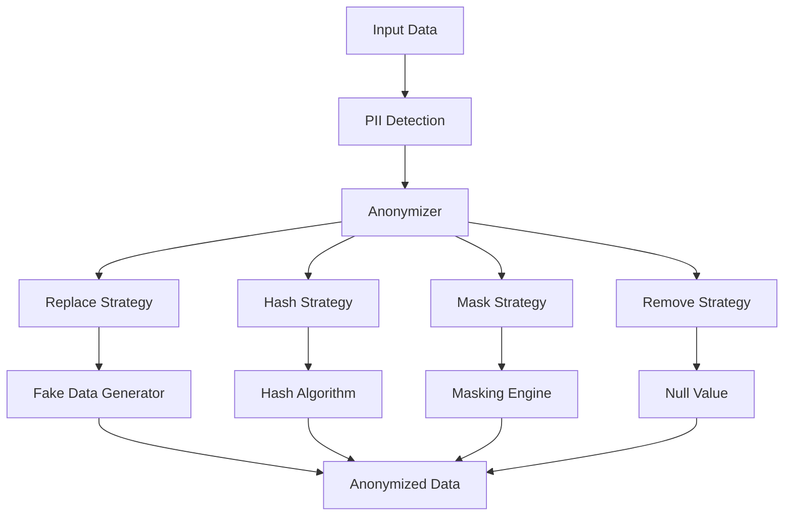

# Anonimize

[](https://github.com/example/anonimize/actions/workflows/ci.yml)
[](https://codecov.io/gh/example/anonimize)
[](https://pypi.org/project/anonimize/)
[](https://www.python.org/)
[](https://opensource.org/licenses/MIT)
[](https://github.com/psf/black)
[](https://anonimize.readthedocs.io)

**A powerful data anonymization tool that uses [Phoney](https://github.com/rar-file/Phoney) to anonymize Personally Identifiable Information (PII) in databases and files while preserving data relationships.**

## Features

- **Multiple Anonymization Strategies**: Replace, hash, mask, or remove sensitive data
- **Database Support**: SQLite, PostgreSQL, and MySQL via SQLAlchemy
- **File Support**: CSV and JSON files
- **PII Detection**: Regex-based and heuristic detection methods
- **Relationship Preservation**: Maintain data consistency across related fields
- **Batch Processing**: Efficiently handle large datasets
- **Easy Integration**: Simple API for integration into existing workflows
- **Fully Typed**: Complete type hints for better IDE support

## Installation

```bash
pip install anonimize
```

With database support:

```bash
pip install "anonimize[postgresql]"  # For PostgreSQL
pip install "anonimize[mysql]"       # For MySQL
pip install "anonimize[all]"         # All database drivers
```

## Quick Start

```python
from anonimize import Anonymizer

# Create anonymizer
anon = Anonymizer()

# Anonymize data
data = {
    "name": "John Doe",
    "email": "john@example.com",
    "phone": "+1-555-123-4567"
}

config = {
    "name": {"strategy": "replace", "type": "name"},
    "email": {"strategy": "replace", "type": "email"},
    "phone": {"strategy": "mask", "type": "phone"},
}

result = anon.anonymize(data, config)
print(result)
# {'name': 'Alice Smith', 'email': 'alice@email.com', 'phone': '***-***-4567'}
```

## Documentation

- [Getting Started](getting-started/quickstart.md)
- [User Guide](user-guide/core-concepts.md)
- [API Reference](api/core.md)
- [Examples](examples/basic.md)

## Supported Strategies

| Strategy | Description | Example |
|----------|-------------|---------|
| `replace` | Replace with fake data | `john@example.com` → `alice@mail.com` |
| `hash` | One-way hash | `john@example.com` → `a3f5c2...` |
| `mask` | Partial masking | `123-45-6789` → `***-**-6789` |
| `remove` | Remove/drop field | `ssn: 123-45-6789` → `ssn: None` |

## Architecture



## Contributing

We welcome contributions! See [CONTRIBUTING.md](https://github.com/example/anonimize/blob/main/CONTRIBUTING.md) for guidelines.

## License

This project is licensed under the MIT License - see the [LICENSE](https://github.com/example/anonimize/blob/main/LICENSE) file for details.
